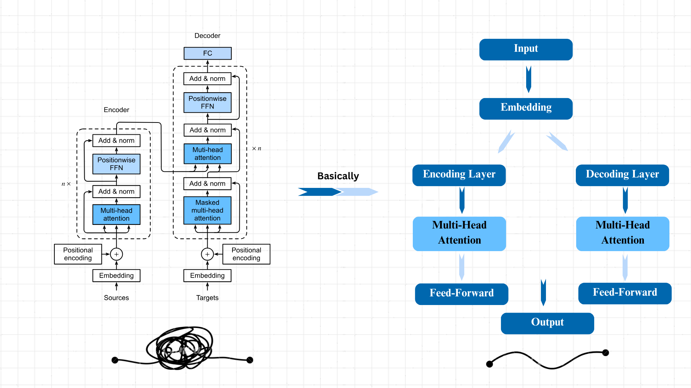
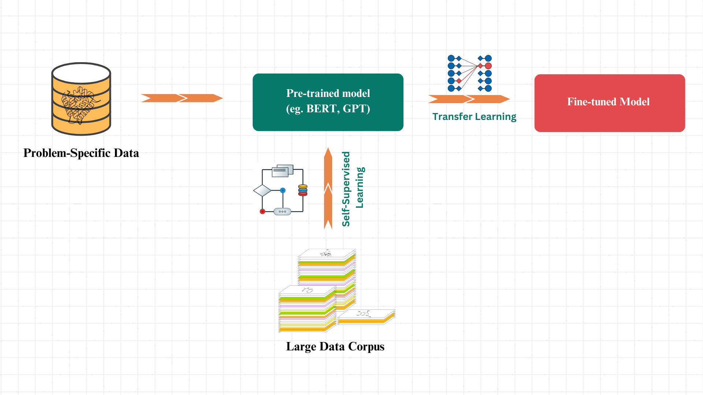

# Self-Supervised Learning of Protein-Ligand Interactions using BERT  

This repository contains the implementation of a self-supervised Bidirectional Encoder Representations from Transformers (BERT) model designed to understand protein-ligand interactions. The goal is to predict how binding site residues influence ligand behavior using masked language modeling (MLM) tasks for both the ligand and protein binding site tokens.

## 1. Theory

### What are Transformers?

Transformers are a type of deep learning model architecture designed for processing sequential data. They were introduced in the 2017 paper *"Attention Is All You Need"* by Vaswani et al. and have become the foundation for many state-of-the-art models in natural language processing (NLP), computer vision, and even protein-ligand modeling.

### Key Concepts of Transformers:

1\. **Self-Attention Mechanism**:

   Transformers rely on a mechanism called *self-attention*, which allows the model to weigh the importance of each word (or token) in a sequence with respect to every other word, regardless of their distance from each other. This is in contrast to models like RNNs, which process data sequentially and can struggle with long-range dependencies.

2\. **Multi-Head Attention**:

   Instead of computing a single attention score for each token, transformers use *multi-head attention*, which allows the model to learn attention from different "perspectives" (or heads). Each head can focus on different parts of the sequence, giving the model a richer understanding of the data.

3\. **Positional Encoding**:

   Unlike RNNs, transformers don't inherently have a sense of order in the input sequence because they process all tokens in parallel. To give the model a sense of position, *positional encodings* are added to the input embeddings, encoding the relative or absolute position of each token in the sequence.

4\. **Feed-Forward Networks**:

   After applying attention, each token representation is passed through a fully connected feed-forward network, which allows for complex transformations and feature extraction.

5\. **Layer Normalization and Residual Connections**:

   Transformers also make extensive use of *layer normalization* and *residual connections*, which help stabilize training and allow the model to capture better representations.

6\. **Encoder-Decoder Architecture**:

   - **Encoder**: In many transformer models, an encoder processes the input sequence. It consists of multiple layers of self-attention followed by feed-forward networks.

   - **Decoder**: In the original transformer architecture for sequence-to-sequence tasks like machine translation, the decoder takes the output of the encoder and generates the target sequence, using both self-attention and cross-attention (which attends to the encoder's outputs).

However, in models like BERT (Bidirectional Encoder Representations from Transformers), only the encoder is used, with slight modifications to make the model bidirectional.

### Transformer Architecture (Simplified Diagram):

```python

Input Embeddings + Positional Encodings

      ↓

[Encoder Block 1]

  ↓

[Encoder Block 2]

  ↓

 ...

[Encoder Block N]

  ↓

Output Embeddings

```

Each *encoder block* contains:

- Self-Attention layer

- Feed-forward network

- Layer normalization + residual connection

### Key Innovations:

- **Parallelization**: Since transformers don't rely on sequential data processing like RNNs, they can be fully parallelized, speeding up training on large datasets.

- **Long-Range Dependencies**: The self-attention mechanism makes it easier for transformers to capture long-range dependencies compared to older models.

### Applications:

- **NLP**: Transformers power models like BERT, GPT, and T5, which are used in tasks such as text generation, classification, translation, summarization, and more.

- **Vision**: Vision Transformers (ViTs) are used to process image data by treating image patches as tokens, allowing the transformer architecture to perform well on image classification tasks.

- **Proteins and Chemistry**: Transformers are being used to model protein-ligand interactions, predict binding sites, and other structural tasks due to their ability to handle large, complex sequences.

Transformers have revolutionized multiple fields, making them one of the most important architectures in deep learning today.



### How do Transformer models benefit the study of Protein-Ligand Interactions?
In biological systems, proteins interact with ligands in binding sites, influencing processes like enzyme catalysis, signal transduction, and drug binding. Understanding how specific residues in the binding site affect ligand binding can significantly aid in drug discovery and design. 

Transformer models offer significant advantages in the study of Protein-Ligand Interactions, primarily due to their ability to leverage large datasets and capture complex relationships in biological data.

1. **Utilization of Extensive Datasets**:
   We often have access to a wealth of experimentally derived protein-ligand complexes from sources like the Protein Data Bank (PDB). This data is invaluable for training machine learning models to predict various outcomes, such as binding site conformations, ligand binding activities, and binding affinities. However, specific applications, like predicting the binding affinity of a ligand for a particular target (e.g., the beta-adrenergic receptor), can suffer from sparse data. 

2. **Role of Pre-trained Models**:
   This is where pre-trained transformer models come into play. By training on a comprehensive dataset these models learn the fundamental principles of protein-ligand interactions. They become adept at understanding the underlying biological mechanisms without being tailored to a specific protein or ligand.

3. **Generalization Across Different Systems**:
   Since transformers are capable of generalizing from their training data, we can leverage a pre-trained model to then fine-tune it for a specific target, such as the beta-adrenergic receptor. This approach is advantageous because it allows us to start with a robust foundation of learned interactions, requiring fewer specific data points to achieve meaningful predictions. Fine-tuning on the specific target can lead to improved accuracy, as the model already understands the broader context of protein-ligand interactions and can focus on the unique characteristics of the target in question.

It is for these reasons that I have developed a self-supervised transformer-based model utilizing the 65,000 protein-ligand complexes from the PDB, aimed at advancing our understanding of protein-ligand interactions and improving predictive accuracy in this area of study.




### Self-Supervised Learning & Masked Language Model (MLM)

Self-supervised learning (SSL) is ideal when dealing with vast amounts of unlabeled data, as it allows models to generate their own supervision signals from the data itself. In the study of protein-ligand interactions, we have abundant structural data from sources like the Protein Data Bank (PDB), but experimentally derived labels, such as binding affinities, are often limited.

Masked Language Modeling (MLM), a core technique in self-supervised learning, trains a model to predict masked parts of the input based on the surrounding context. In the original NLP setting, MLM teaches transformers like BERT to understand the relationships between words by masking certain words in a sentence.

In the context of protein-ligand interactions, I apply the same principle by masking atoms of the ligand or residues in the binding site. The model learns to predict the masked atoms or residues based on the surrounding structural and chemical context, thereby learning spatial and chemical dependencies critical to protein-ligand interactions.

This method is highly effective for capturing the intricate details of how ligands interact with proteins. Once pre-trained in this way, the model can then be fine-tuned for specific downstream tasks, significantly improving its predictive performance.


## 2. Implementation and Mathametical Foundation of BindAxTransformer

## **Step 1: Extraction of Protein and Ligand Properties**

In this step, we parse Protein Data Bank (PDB) files to extract detailed information about the protein and ligand atoms in a protein-ligand complex. Specifically, we aim to obtain:

- **Atom Type**: The type of each atom (e.g., carbon, nitrogen).

- **Element**: The chemical element symbol (e.g., C for carbon).

- **Coordinates**: The 3D spatial coordinates (x, y, z) of each atom.

- **Residue Information** (for proteins): The amino acid residue type and number.

  
1. **Parsing and Tokenizing Atoms**

```python
def tokenize_atom(line, molecule_type):
# Extract atom details from a line in the PDB file
 ```

* **Input**: A line from the PDB file and a molecule type identifier (0 for ligand, 1 for protein).

* **Process**: Extracts atom properties using string slicing based on PDB format specifications.

* **Output**: A dictionary containing the extracted properties.

2. **Parsing the PDB File**

```python
def parse_and_tokenize_pdb(pdb_file):
# Read the PDB file and tokenize all atoms
```

* **Process**: Reads all lines in the PDB file and separates ligand and protein atoms based on record types (`HETATM` for ligands, `ATOM` for proteins).

* **Output**: A combined list of tokenized ligand and protein atoms.

3. **Calculating Interatomic Distances**

```python 
def calculate_distance(coord1, coord2):
# Compute Euclidean distance between two atoms
```
* **Input**: Coordinates of two atoms.

* **Process**: Calculates the Euclidean distance using the formula:

$$\text{Distance} = \sqrt{(x_2 - x_1)^2 + (y_2 - y_1)^2 + (z_2 - z_1)^2}$$
  
* **Output**: The scalar distance between the two atoms.

4. **Finding Interactions**

```python
def find_interactions(ligand_tokens, protein_tokens, distance_threshold=5.0):
# Identify atom pairs within a specified distance
```

* **Process**: For each ligand atom, computes distances to all protein atoms and identifies pairs within the distance threshold (e.g., 5.0 Ångströms).

* **Output**: A list of interacting atom pairs along with their distances.


#### **PDB Format Parsing**

- **Atom Line Format**: Each line in a PDB file representing an atom follows a specific format. For example:

```python
ATOM      1  N   MET A   1      38.428  13.104   6.364  1.00 54.69           N
```
- **Columns**:
  - **Atom Serial Number (7-11)**: Unique identifier for the atom.
  - **Atom Name (13-16)**: The name of the atom.
  - **Residue Name (18-20)**: The name of the amino acid residue.
  - **Chain Identifier (22)**: Protein chain identifier.
  - **Residue Sequence Number (23-26)**: The sequence number of the residue.
  - **Coordinates (31-54)**: x, y, z coordinates of the atom.
  - **Element Symbol (77-78)**: The chemical element symbol.

- **Extraction**: Using string slicing, we extract these fields for each atom.

#### **Euclidean Distance Calculation**

Given two atoms with coordinates $$\((x_1, y_1, z_1)\)$$ and $$\((x_2, y_2, z_2)\)$$, the Euclidean distance is calculated as:

$$\text{Distance} = \sqrt{(x_2 - x_1)^2 + (y_2 - y_1)^2 + (z_2 - z_1)^2}$$

This calculation identifies atoms that are spatially close and potentially interacting.

### **Example**

Let's consider a simplified example with one ligand atom and one protein atom.

- **Ligand Atom**:
   - **Atom Type**: C1
   - **Element**: C
   - **Coordinates**: (10.0, 10.0, 10.0)

- **Protein Atom**:
   - **Atom Type**: N
   - **Element**: N
   - **Coordinates**: (12.0, 10.0, 10.0)
   - **Residue Type**: MET
   - **Residue Number**: 1

#### **Distance Calculation**

$$\text{Distance} = \sqrt{(12.0 - 10.0)^2 + (10.0 - 10.0)^2 + (10.0 - 10.0)^2} = \sqrt{(2.0)^2} = 2.0  \text{Å}$$

Since the distance (2.0 Å) is less than the threshold (5.0 Å), we consider these atoms to be interacting.

---

## **Step 2: Tokenization of the Extracted Properties**

In this step, we convert the extracted atom properties into numerical representations (tokens) suitable for input into a BERT model. Tokenization involves mapping discrete categorical variables to integer IDs and preparing continuous variables for model ingestion.

1. **Defining the Dataset Class**

```python

class ProteinLigandDataset(Dataset):
#Custom dataset for handling protein-ligand interactions
```
- **Attributes**:
   - `self.tokens`: A list of interaction tokens extracted previously.
   - `self.token2id`: A mapping from token strings to unique integer IDs.

2. **Implementing `__getitem__`**

```python
def __getitem__(self, idx):
# Retrieves and processes a single data point
```

- **Process**:
   - **Input IDs**: Converts categorical variables (e.g., atom types, elements) to integer IDs using `self.token2id`.
   - **Coordinates**: Combines ligand and protein atom coordinates into a single tensor.
   - **Distance**: The scalar distance between the interacting atoms.
   - **Attention Mask**: A binary mask indicating the presence of tokens (used in BERT models).

3. **Collate Function for DataLoader**

```python
def collate_fn(batch):
# Aggregates multiple data points into a batch
```

- **Process**:
   - Pads sequences to ensure uniform length across the batch.
   - Stacks coordinates and distances into tensors.


4. **Tokenization**

* **Categorical Variables**: Atom types, elements, and residue types are categorical and require encoding.

   * **Token Mapping**:
      * Create a vocabulary (`token2id`) that assigns a unique integer ID to each unique token in the dataset.
* For example:

| Token                     | ID |
|---------------------------|----|
| `ligand_atom_C1`         | 1  |
| `ligand_element_C`       | 2  |
| `protein_atom_N`         | 3  |
| `protein_element_N`      | 4  |
| `protein_residue_MET`    | 5  |


**Input IDs**: Each data point's categorical variables are converted to a sequence of IDs.

**Input IDs** = ID<sub>ligand_atom</sub>, ID<sub>ligand_element</sub>, ID<sub>protein_atom</sub>, ID<sub>protein_element</sub>, ID<sub>protein_residue</sub>


* **Continuous Variables**
   * **Coordinates**: These are continuous variables representing spatial positions.
   * **Normalization**: Coordinates may be normalized to improve model training, typically by centering and scaling:

$$
\text{Normalized } x_i = \frac{x_i - \mu_x}{\sigma_x}
$$

where $$\(\mu_x\)$$ and $$\(\sigma_x\)$$ are the mean and standard deviation of the $$\(x\)$$-coordinates in the dataset.

- **Distance**: Also a continuous variable, possibly normalized similarly.

5. **Attention Mask**

- Used in transformer models to indicate which tokens are valid (1) and which are padding (0).

### **Example**

Using the previous example, let's tokenize the interaction.

- **Tokens**:

  - `ligand_atom_C1`: ID 1

  - `ligand_element_C`: ID 2

  - `protein_atom_N`: ID 3

  - `protein_element_N`: ID 4

  - `protein_residue_MET`: ID 5

- **Input IDs**:

$$\text{Input IDs} = [1, 2, 3, 4, 5]$$

- **Coordinates**:

$$\text{Coordinates} = [10.0, 10.0, 10.0, 12.0, 10.0, 10.0]$$


- **Distance**:

$$\text{Distance} = [2.0]$$

- **Attention Mask**:

$$\text{Attention Mask} = [1, 1, 1, 1, 1]$$


### **Preparing for BERT Model**

The BERT model expects inputs in a specific format:

- **Input IDs**: A sequence of token IDs.

- **Attention Mask**: Indicates which tokens are actual data.

- **Optional Position Embeddings**: Since we're dealing with spatial data, we might include positional information.

#### **Incorporating Coordinates**

- **Embedding Coordinates**:

  - Coordinates can be embedded separately or concatenated with token embeddings.

  - Alternatively, a custom embedding layer can process the coordinates.

#### **Mathematical Representation in the Model**

- **Embedding Layer**:

  - Transforms input IDs into dense vector representations:

  $$\mathbf{E}_{\text{input}} = \text{EmbeddingMatrix} \times \text{Input IDs}$$


- **Model Input**:

  - The model input might be a combination of token embeddings and coordinate embeddings.

---

## Step 3. BERT Model

### 1. **Model Definition and Initialization**

The `BertConfig` class is responsible for holding the hyperparameters for a BERT model. Here's a breakdown of the key parameters, their meanings, and the mathematical concepts involved.


```python

class ProteinLigandTransformer(nn.Module):

    def __init__(self, vocab_size, hidden_size=1152, num_attention_heads=12, num_hidden_layers=12):

        super(ProteinLigandTransformer, self).__init__()

        config = BertConfig(

            vocab_size=vocab_size,

            hidden_size=hidden_size,

            num_attention_heads=num_attention_heads,

            num_hidden_layers=num_hidden_layers

        )

        self.bert = BertModel(config)

```


### Key Parameters Explained

1\. **`vocab_size`**:

   - This parameter defines the number of unique tokens (words, subwords, or special tokens) in the model's vocabulary.

   - **Mathematics**: The embedding matrix \(E\) is of shape \((\text{vocab_size}, \text{hidden_size})\). Each token corresponds to a row in this matrix, which transforms the token ID into a dense vector.

```math
\vec{E} = \begin{bmatrix} 
e_1 \\ 
e_2 \\ 
\vdots \\ 
e_{\text{vocab\_size}} 
\end{bmatrix}
```
```math
\quad \text{where } e_i \in \mathbb{R}^{\text{hidden\_size}}
```
2. **`hidden_size`**:

* This parameter indicates the size of the hidden layers within the transformer architecture. It is critical as it dictates the dimensionality of the input and output embeddings at each layer.

* **Mathematics**: The representation of input tokens (or embeddings) is of shape, (batch_size, sequence_length, hidden_size)


3. **`num_attention_heads`**:

* This parameter defines the number of attention heads in the multi-head self-attention mechanism.

* **Mathematics**: Each attention head operates on a separate linear transformation of the input embeddings. The total number of attention heads is typically chosen such that `hidden_size` is divisible by  `num_attention_heads`.

The attention head output can be represented as:

$$\text{Attention}(Q, K, V) = \text{softmax}\left(\frac{QK^T}{\sqrt{d_k}}\right)V$$

where,
```math
d_k = \frac{\text{hidden\_size}}{\text{num\_attention\_heads}} 
```

4\. **`num_hidden_layers`**:

* This parameter specifies how many transformer blocks (layers) the model consists of.

* **Mathematics**: The output of one layer serves as the input to the next layer. Therefore, the depth of the network significantly influences its capacity to learn complex representations.

5\. **`intermediate_size`**:

* This is the size of the "intermediate" (feedforward) layer, which is larger than the hidden size. It's used in the position-wise feedforward network within each transformer block.

* **Mathematics**: The feedforward network (FFN) can be mathematically expressed as:

```math
\text{FFN}(x) = \text{max}(0, xW_1 + b_1)W_2 + b_2
```
where `W₁` has shape `(hidden_size, intermediate_size)` and `W₂` has shape `(intermediate_size, hidden_size)`

6\. **`hidden_act`**:

* The activation function used in the feedforward network, typically "gelu" (Gaussian Error Linear Unit) or "relu" (Rectified Linear Unit).

* **Mathematics**: The GELU activation function is defined as:

```math
 \text{GELU}(x) = x \cdot \Phi(x) = 0.5x \left(1 + \text{tanh}\left(\sqrt{\frac{2}{\pi}} \left(x + 0.044715x^3\right)\right)\right)
```
This nonlinear function allows the model to learn complex relationships in the data.

7\. **`dropout_prob`**:

* This parameter is used to prevent overfitting by randomly setting a fraction of the input units to zero during training.

* **Mathematics**: If \(x\) is the input to a layer, applying dropout can be represented as:

```math
  

   x' = \text{Dropout}(x, p) = 

   \begin{cases} 

   0 & \text{with probability } p \

   \frac{x}{1-p} & \text{with probability } 1-p 

   \end{cases}

```
   where \(p\) is the dropout probability.

8\. **`attention_probs_dropout_prob`**:

* Similar to `dropout_prob`, but specifically for the attention probabilities during the computation of the attention weights.

* **Mathematics**: This is applied after the attention scores are calculated to ensure robustness against overfitting.

### Example of BERT Forward Pass

Let's walk through the computations involved in a forward pass through a single transformer block in BERT.

1\. **Input Embedding**:

* An input sequence of tokens is represented as an embedding matrix \(E\).

* If our vocabulary size is 10000 and the hidden size is 768, then the embedding matrix \(E\) is:

```math
  

   E \in \mathbb{R}^{10000 \times 768}

   
```

2\. **Self-Attention Calculation**:

* Given an input matrix \(X\) of shape \((\text{batch\_size}, \text{sequence\_length}, \text{hidden\_size})\), we compute \(Q\), \(K\), and \(V\) via linear transformations:

```math
   

   Q = XW_Q, \quad K = XW_K, \quad V = XW_V

   
```
   where \(W_Q\), \(W_K\), and \(W_V\) are weight matrices of shape \((\text{hidden\_size}, \text{hidden\_size})\).

3\. **Attention Scores**:

* Compute the scaled dot-product attention scores:

```math
  

   \text{scores} = \frac{QK^T}{\sqrt{d_k}}

  
```

4\. **Softmax**:

* Apply the softmax function to obtain the attention weights:

```math
  

   A = \text{softmax}(\text{scores})

  
```

5\. **Output**:

* Finally, compute the attention output:

```math
 

   \text{output} = AV

  
```

6\. **Feedforward Network**:

* The output from the attention mechanism is then passed through the feedforward network (FFN):

```math


   \text{FFN}(\text{output}) = \text{max}(0, \text{output}W_1 + b_1)W_2 + b_2

   
```

### 2. **Coordinate and Distance Encoders**

```python

self.coordinate_encoder = nn.Linear(6, hidden_size)  # 6 for x,y,z of both ligand and protein

self.distance_encoder = nn.Linear(1, hidden_size)

self.cls = nn.Linear(hidden_size, vocab_size)

```


* **Coordinate Encoder**: 
   * This linear layer takes a 6-dimensional input (x, y, z coordinates of the ligand and protein) and projects it to the hidden size. The operation can be mathematically represented as:

   $$\text{output} = W \cdot \text{input} + b$$

where `W` is the weight matrix of shape `(hidden_size, 6)` and `b` is the bias vector.


* **Distance Encoder**: 
   * This linear layer maps a 1-dimensional distance value to the hidden size.

* **Classification Layer (`cls`)**: 
   * This layer projects the hidden states back to the vocabulary size for token classification.

### 3. **Forward Method**

```python

def forward(self, input_ids=None, coordinates=None, distances=None, attention_mask=None):

    token_embeddings = self.bert.embeddings(input_ids) if input_ids is not None else None

```

#### Explanation:

* **Token Embeddings**: 
   * The input token IDs are passed through BERT's embedding layer to obtain embeddings. Each token ID is associated with a corresponding vector in the embedding matrix of shape `(vocab_size, hidden_size)`
.

### 4. **Encoding Coordinates and Distances**

```python

coordinate_embeddings = self.coordinate_encoder(coordinates).unsqueeze(1)

distance_embeddings = self.distance_encoder(distances).unsqueeze(1)

```

#### Explanation:

* **Encoding**: 
   * The coordinates and distances are encoded using their respective linear layers, resulting in matrices of shape \((\text{batch_size}, 1, \text{hidden_size})\).

### 5. **Combining Embeddings**

```python

if token_embeddings is not None:

    embeddings = token_embeddings + coordinate_embeddings + distance_embeddings

else:

    embeddings = coordinate_embeddings + distance_embeddings

```

#### Explanation:

* **Element-wise Addition**: 
   * The embeddings are combined. If `token_embeddings` is not None, the embeddings from tokens, coordinates, and distances are summed. This step effectively fuses the different types of information (semantic and spatial).

### 6. **Passing Through BERT**

```python

outputs = self.bert(inputs_embeds=embeddings, attention_mask=attention_mask)

sequence_output = outputs[0]  # Output from the last hidden layer

```

#### Explanation:

* **BERT Forward Pass**:

  * The combined embeddings are passed through the BERT model. BERT applies a series of transformations including self-attention and feedforward networks.

  * The self-attention mechanism can be mathematically represented as:

$$\text{Attention}(Q, K, V) = \text{softmax}\left(\frac{QK^T}{\sqrt{d_k}}\right)V$$

where:

- `Q` (Query), `K` (Key), and `V` (Value) are derived from the input embeddings.

-  $$\(d_k\)$$ is the dimension of the keys (number of features in the keys).

- The output is a weighted sum of the values, where the weights are determined by the similarity between queries and keys.


### 7. **Classification Layer**

```python

logits = self.cls(sequence_output)

```

#### Explanation:

* **Classification**: 
   * The output from the last hidden layer of BERT is fed into the classification layer to produce logits for each token.

### 8. **Main Function**

```python

def main():

    directory = 'mysite'

    all_tokens = process_pdb_files(directory)

```

#### Explanation:

* **Data Processing**: 
   * The data from PDB files is processed to extract tokens, which will then be used for training the model.

### 9. **Creating Vocabulary and Splitting Data**

```python

vocab = set()

for token in all_tokens:

    vocab.add(f"ligand_atom_{token['ligand_atom']}")

    vocab.add(f"ligand_element_{token['ligand_element']}")

    vocab.add(f"protein_atom_{token['protein_atom']}")

    vocab.add(f"protein_element_{token['protein_element']}")

    vocab.add(f"protein_residue_{token['protein_residue']}")

```

#### Explanation:

* **Vocabulary Creation**: 
   * A unique set of tokens is created from the processed data. Each token represents a specific feature of the ligand or protein, allowing the model to learn from diverse inputs.

### 10. **Training Loop**

```python

for epoch in range(num_epochs):

    model.train()

    train_loss = 0

    for batch in train_dataloader:

        input_ids = batch['input_ids'].to(device)

        coordinates = batch['coordinates'].to(device)

        distances = batch['distances'].to(device)

        attention_mask = batch['attention_mask'].to(device)

        optimizer.zero_grad()

        outputs = model(input_ids=input_ids, coordinates=coordinates, distances=distances, attention_mask=attention_mask)

        labels = input_ids.clone()

        mask = torch.bernoulli(torch.full(input_ids.shape, 0.15)).bool()

        labels[~mask] = -100  # Only compute loss on masked tokens

        loss = criterion(outputs.view(-1, len(token2id)), labels.view(-1))

        loss.backward()

        optimizer.step()

        train_loss += loss.item()

```

#### Explanation:

* **Training**:
   * The model is trained over several epochs. For each batch:
   * The optimizer updates the model weights based on the computed loss.
   * The loss is calculated using the Cross Entropy Loss function, which is common for multi-class classification tasks.

### Summary of Mathematical Concepts

* **Linear Layers**: Implement matrix multiplication and bias addition.

* **Attention Mechanism**: Computes relationships between input tokens.

* **Cross-Entropy Loss**: Measures the difference between predicted probabilities and actual labels, guiding the optimization of the model.

### Example Matrix Operations

Let's illustrate how matrices are involved in a simple linear transformation:

Assuming we have a coordinate input \(C\):

```math

C = \begin{bmatrix}

x_1 \

y_1 \

z_1 \

x_2 \

y_2 \

z_2

\end{bmatrix}
```

After passing through the coordinate encoder with weight matrix \(W\):

```math

W = \begin{bmatrix}

w_{11} & w_{12} & w_{13} & w_{14} & w_{15} & w_{16} \

... & ... & ... & ... & ... & ... \

w_{n1} & w_{n2} & w_{n3} & w_{n4} & w_{n5} & w_{n6}

\end{bmatrix}

```

The output will be:

```math

E = W \cdot C + b

```

Where \(E\) is the encoded representation in hidden space. Each dimension of \(E\) will correspond to a feature in the transformer model.


---

## 3. Detailed Code Explanation for BindAxTransformer

I have created a separate repository that explains the code behind **BindAxTransformer** line by line. You can find that repository [here](https://github.com/gautammalik-git/Understanding-BindAxTransformer.git).


## 4. Usage

### Prerequisites
To run the code, you will need:
- Python 3.7+
- PyTorch
- Hugging Face `transformers`
- scikit-learn for splitting data

You can install the required dependencies using:
```bash
pip install torch transformers scikit-learn numpy
```

If in case the torch module is still not installed try using:

```bash
pip3 install torch torchvision 
```

If you are using conda you can also try:

```bash
conda install pytorch torchvision -c pytorch
```
### Running the code
```bash
python bindax_trans.py
```
Ensure that you update the directory name containing the training complexes in the Python script.

## 5. Conclusion 

This repository provides a guide for understanding and implementing a self-supervised transformer model for protein-ligand interactions. Currently, the code includes only coordinates and atom/residue types as tokens. However, you can enhance the model by incorporating additional tokens such as distances between atoms and residues, dihedral angles, charges, and more. The goal of this repository is to offer a flexible foundation for protein-ligand interaction transformer model, allowing anyone to fine-tune it to their specific needs. I'm also working on a larger project that leverages this pre-trained model, but instead of releasing everything at once, I’m sharing this code first. Stay tuned for more exciting updates and keep building your own projects!
